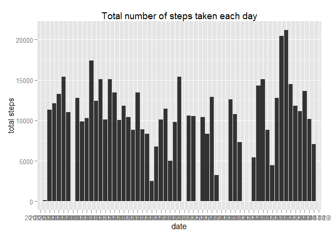
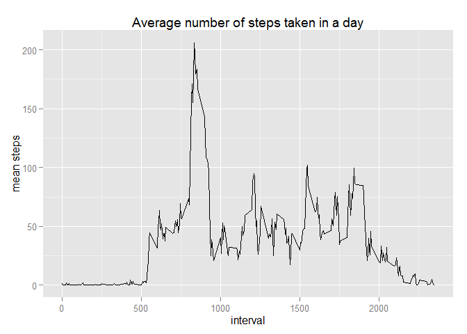
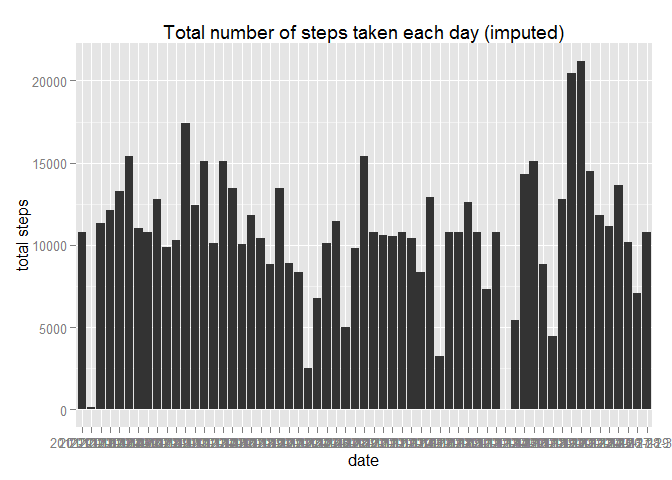
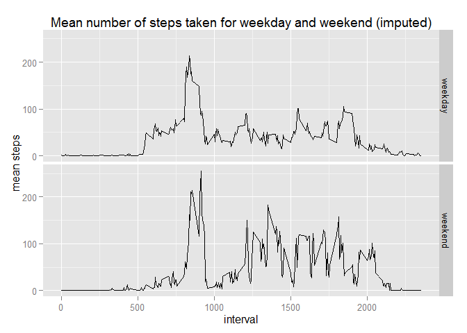

# Reproducible Research: Peer Assessment 1


## Loading and preprocessing the data


```r
theDataFile = unzip('activity.zip')
theData = read.csv(theDataFile)

library(plyr)
library(ggplot2)
library(dplyr)
```

```
## 
## Attaching package: 'dplyr'
## 
## The following objects are masked from 'package:plyr':
## 
##     arrange, count, desc, failwith, id, mutate, rename, summarise,
##     summarize
## 
## The following object is masked from 'package:stats':
## 
##     filter
## 
## The following objects are masked from 'package:base':
## 
##     intersect, setdiff, setequal, union
```

```r
library(reshape2)
```

## What is mean total number of steps taken per day?


```r
theSum = ddply(theData, .(date), summarise, total = sum(steps, na.rm=TRUE))

theSumPlot = ggplot(data=theSum, aes(x=theSum$date, y=theSum$total))
theSumPlot +  geom_bar(stat='identity') +
  xlab('date') +
  ylab('total steps') +
  ggtitle('Total number of steps taken each day')
```

 

```r
#summary(theSum)
theMean = mean(theSum$total)
theMedian = median(theSum$total)
sprintf('The mean total number of steps per day is %f', theMean)
```

```
## [1] "The mean total number of steps per day is 9354.229508"
```

```r
sprintf('The median total number of steps per day is %f', theMedian)
```

```
## [1] "The median total number of steps per day is 10395.000000"
```

## What is the average daily activity pattern?


```r
theMean = ddply(theData, .(interval), summarise, mean = mean(steps, na.rm=TRUE))

theMeanPlot = ggplot(data=theMean, aes(x=theMean$interval, y=theMean$mean))
theMeanPlot + geom_line() +
  xlab('interval') +
  ylab('mean steps') +
  ggtitle('Average number of steps taken in a day')
```

 

```r
theInterval = which.max(theMean$mean)
theIntervalValue = theMean$interval[theInterval]
sprintf('The interval with the maximum average number of steps is %d', theInterval)
```

```
## [1] "The interval with the maximum average number of steps is 104"
```

```r
sprintf('Its value is %d mins', theIntervalValue)
```

```
## [1] "Its value is 835 mins"
```

## Imputing missing values


```r
naCount = sum(is.na(theData$steps))
sprintf('The number of rows with NA is %d', naCount)
```

```
## [1] "The number of rows with NA is 2304"
```

# Imputation strategy
As there are cases with NA for the entire day (eg. 2012-10-01), using mean for that day is not applicable. A more robust way is to use the mean of an interval averaged across all the days.


```r
theImputedData = theData
for(i in 1:nrow(theImputedData))
{
  if(is.na(theImputedData$steps[i])){
    theInterval = theImputedData$interval[i]
    theValueRow = filter(theMean, interval==theInterval)
    theImputedData$steps[i] = theValueRow$mean[1]
  }
}
#summary(theImputedData)

theImputedSum = ddply(theImputedData, .(date), summarise, total = sum(steps, na.rm=TRUE))

theImputedSumPlot = ggplot(data=theImputedSum, aes(x=theImputedSum$date, y=theImputedSum$total))
theImputedSumPlot + geom_bar(stat='identity') +
  xlab('date') +
  ylab('total steps') +
  ggtitle('Total number of steps taken each day (imputed)')
```

 

```r
#summary(theSum)
theImputedMean = mean(theImputedSum$total)
theImputedMedian = median(theImputedSum$total)
sprintf('The mean total number of steps per day is %f', theImputedMean)
```

```
## [1] "The mean total number of steps per day is 10766.188679"
```

```r
sprintf('The median total number of steps per day is %f', theImputedMedian)
```

```
## [1] "The median total number of steps per day is 10766.188679"
```

# The impact of imputing missing data
The mean and median total steps per day have increased. The histogram shows that there are a few days where total number of steps is truly zero and not due to missing data.

## Are there differences in activity patterns between weekdays and weekends?


```r
weekDay = function(date)
{
  weekday = as.POSIXlt(as.Date(date))$wday
  return (weekday)
}
theWeekData = mutate(theImputedData, weekday = weekDay(date))
theWeekdayData = theWeekData[theWeekData$weekday <= 5,]
theWeekendData = theWeekData[theWeekData$weekday > 5,]

theWeekdayMean = ddply(theWeekdayData, .(interval), summarise, mean = mean(steps, na.rm=TRUE))
theWeekendMean = ddply(theWeekendData, .(interval), summarise, mean = mean(steps, na.rm=TRUE))
theMerged = merge(theWeekdayMean, theWeekendMean, by='interval')
names(theMerged) = c('interval', 'weekday', 'weekend')

theMelted = melt(theMerged,id.vars=c('interval'))

theWeekPlot = ggplot(data=theMelted, aes(x=interval, y=value))
theWeekPlot + facet_grid(variable~.) +
  geom_line() +
  xlab('interval') +
  ylab('mean steps') +
  ggtitle('Mean number of steps taken for weekday and weekend (imputed)')
```

 
